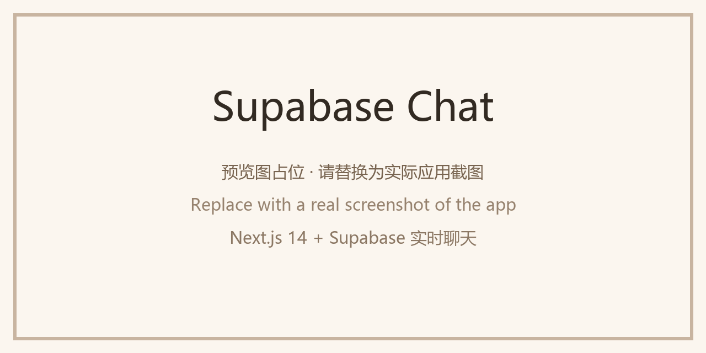

# Supabase Chat · 密码保护实时聊天



基于 **Next.js 14 (App Router) + Supabase** 的实时聊天应用，支持多房间、富媒体、消息编辑/撤回/表情回应、全文搜索、暗色模式、在线状态与打字指示、Web Push，以及**可开关的密码门禁**与**独立的管理后台**。

## 功能特性

- 💬 实时聊天（Supabase Realtime）、多房间、富媒体（图片/视频/语音）
- 📝 Markdown 渲染（代码高亮 + XSS 过滤）、表情回应、消息编辑/撤回
- 🔍 全局搜索、草稿自动保存、@提及红点、服务端权威送达（离线不丢消息）
- 🌙 暗色模式、在线状态与打字指示、Web Push 推送
- 🔐 密码门禁（可开关）、独立管理后台 `/admin`（双会话物理隔离）

## 技术栈

| 层 | 技术 |
|---|---|
| 框架 | Next.js 14.2（App Router，Edge Runtime API Routes） |
| 语言 | TypeScript 5（strict） |
| 数据库 / 实时 | Supabase（PostgreSQL + Realtime + Storage） |
| 鉴权 | 自研 HS256 JWT（Web Crypto API）+ httpOnly Cookie（双会话隔离） |
| 部署 | Cloudflare Pages（`@cloudflare/next-on-pages`） |
| 边缘函数 | Supabase Edge Functions（Deno）— 服务端消息广播 |
| 测试 | Vitest + Testing Library |

## 快速开始

```bash
git clone <your-repo-url> supabase-chat
cd supabase-chat
npm install
cp .env.example .env.local      # 填入 Supabase 凭证与密码（见「部署」）
npm run dev                     # http://localhost:3000
```

打开 `/` 输入 `CHAT_PASSWORD` 进入聊天；打开 `/admin` 输入 `ADMIN_PASSWORD` 进入后台。

## 部署

本项目部署到 **Cloudflare Pages**，构建命令 `npm run cf:build`，输出目录 `.vercel/output/static`。
完整流程（准备 Supabase、配置环境变量、应用迁移、部署 Edge Function、配置保活、构建 Android APK、API 参考、故障排除）见 **[docs/DEPLOYMENT.md](docs/DEPLOYMENT.md)**。

## 免费层（Free tier）

本项目可完全跑在各大平台的免费层上，**零成本自托管**：

- **Cloudflare Pages**：免费托管前端，含构建、请求量与带宽额度，无需信用卡。
- **Supabase Free**：免费 Postgres + Realtime + Storage + Edge Functions。
  - ⚠️ 免费项目约 **7 天无数据库活动会被自动暂停**（所有读写与实时订阅失败）。仓库内的 `keepalive.yml` 每 6 小时 ping 一次保活端点来规避——你需要在仓库 `Settings → Variables` 设 `KEEPALIVE_URL`（你的部署地址），否则保活任务会失败。
- **ImgBB / VAPID**：图片代理与 Web Push 均可用免费方案，非必需。

> 只要 Supabase 用免费层，就务必保留 keepalive 定时任务并正确配置 `KEEPALIVE_URL`，否则隔一阵子站点会"冻住"。

## 配置参数获取

部署与 CI 所需的密钥 / 变量，获取位置如下（完整说明见 [docs/DEPLOYMENT.md](docs/DEPLOYMENT.md)）：

| 参数 | 获取位置 |
|---|---|
| `NEXT_PUBLIC_SUPABASE_URL` | Supabase 项目 → **Project Overview** 首页顶部（项目名下方带 Copy 按钮的 URL，形如 `https://<ref>.supabase.co`） |
| `NEXT_PUBLIC_SUPABASE_KEY` / `SUPABASE_SERVICE_ROLE_KEY` | 同项目 → **Project Settings → API Keys**：**Publishable key**（`sb_publishable_…`，公开、可进浏览器）与 **Secret key**（`sb_secret_…`；保密，仅服务端用，切勿加 `NEXT_PUBLIC_` 前缀） |
| `SUPABASE_PROJECT_REF` | Supabase Dashboard → **Project Settings → General** → Project ID / Reference ID（仅本地 `supabase` CLI 用；关联仓库后 CI 不再需要） |
| `SUPABASE_ACCESS_TOKEN` | Supabase 头像菜单 → **Account → Access Tokens** → 新建（仅本地 `supabase` CLI 用；采用 Supabase GitHub App 关联仓库后 CI 不再需要） |
| `CLOUDFLARE_API_TOKEN` / `CLOUDFLARE_ACCOUNT_ID` | **已不需要**（采用 Cloudflare Pages Git 集成，不在仓库配 Cloudflare 密钥）；仅当你改用 `wrangler` CLI 手动部署时才需申请 |
| `BROADCAST_SIGNING_KEY` | 本地 `node scripts/gen-broadcast-keys.mjs` 生成、或双击 `scripts/gen-broadcast-keys.html` 一键生成的 Ed25519 **私钥**（PKCS8 base64），设为 **Supabase 项目函数密钥**（Dashboard → Edge Functions → Secrets 或 `supabase secrets set`），用于广播防伪造（非 GitHub Secret）。与之配对的**公钥**须设为 Cloudflare 构建变量 `NEXT_PUBLIC_BROADCAST_VERIFY_KEY`（前端内联的默认公钥与你的私钥不匹配，不填会导致广播校验失败） |
| `CHAT_PASSWORD` / `CHAT_JWT_SECRET` / `ADMIN_PASSWORD` | 自行设定的随机值（非平台获取，建议 ≥32 位随机串） |
| `KEEPALIVE_URL` / `APP_URL` | 你自己的部署域名，设为仓库 **Variables**（非 Secrets） |

> 标记 **Secrets** 的项在 GitHub 仓库 `Settings → Secrets and variables → Actions → Secrets` 配置；标记 **Variables** 的项在同级 **Variables** 页配置。

## 文档

- [docs/DEPLOYMENT.md](docs/DEPLOYMENT.md) — 完整部署指南（环境变量 / Cloudflare Pages / 自部署 / 迁移 / Edge Function / 保活 / APK / API / 故障排除）
- [docs/ARCHITECTURE.md](docs/ARCHITECTURE.md) — 架构速览（双会话鉴权、middleware、数据模型、消息送达机制、安全纵深）
- 历史设计文档：`docs/ARCHITECTURE-12-features.md` / `docs/PRD-12-features.md` / `docs/refactor-groupchat-design.md`（部分鉴权描述已过时，以本仓库 README 与 `docs/ARCHITECTURE.md` 为准）
- 图：`docs/class-diagram.mermaid` / `docs/sequence-diagram.mermaid`

## 许可证

采用 MIT 许可证。
