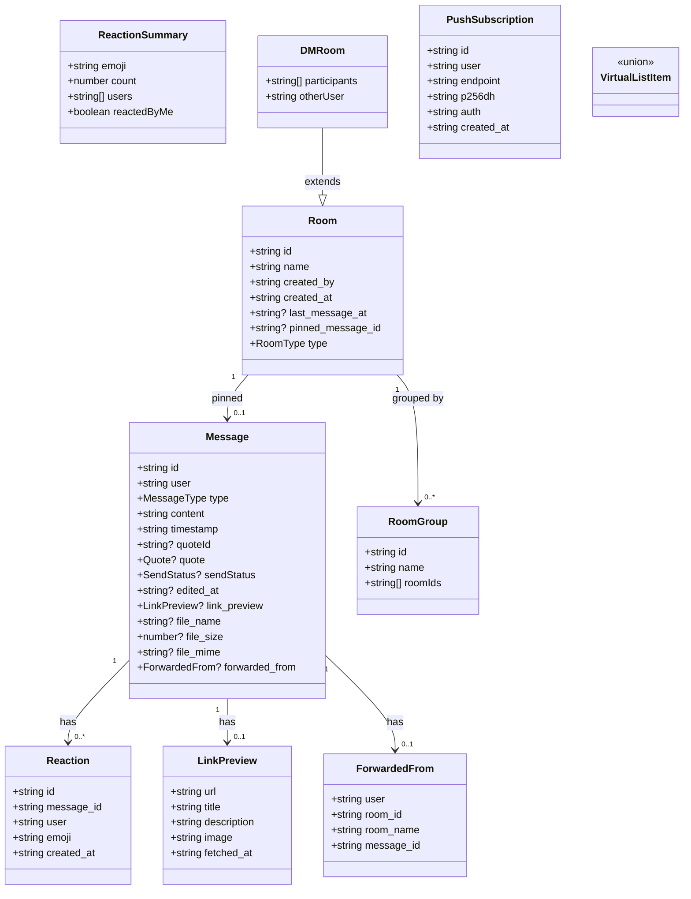
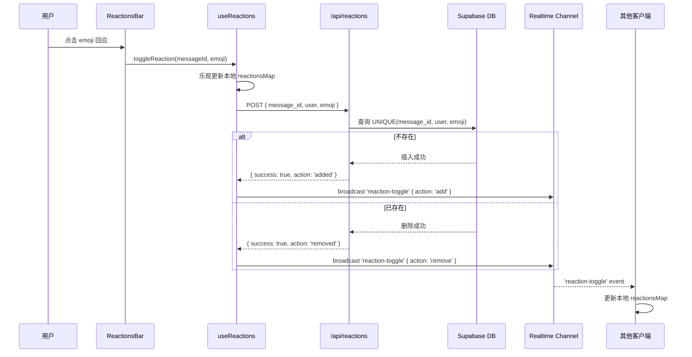
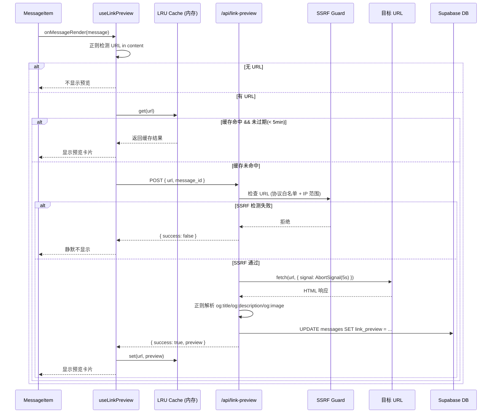
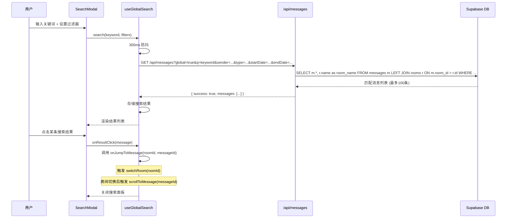
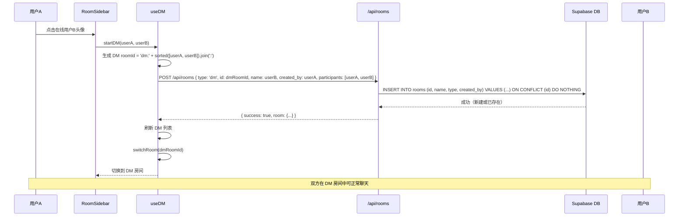
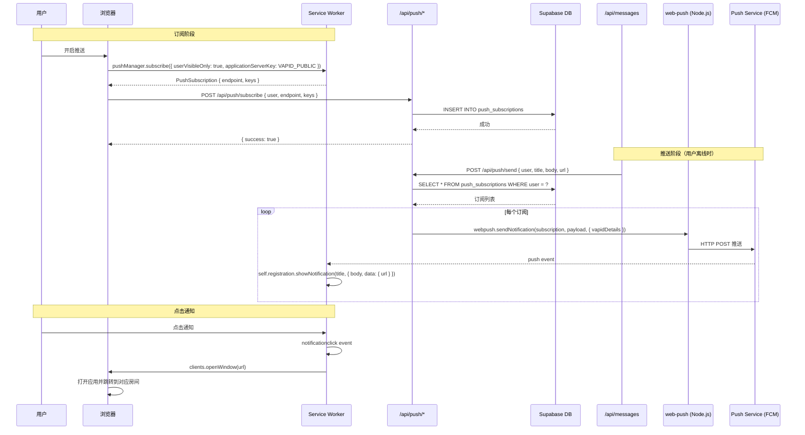
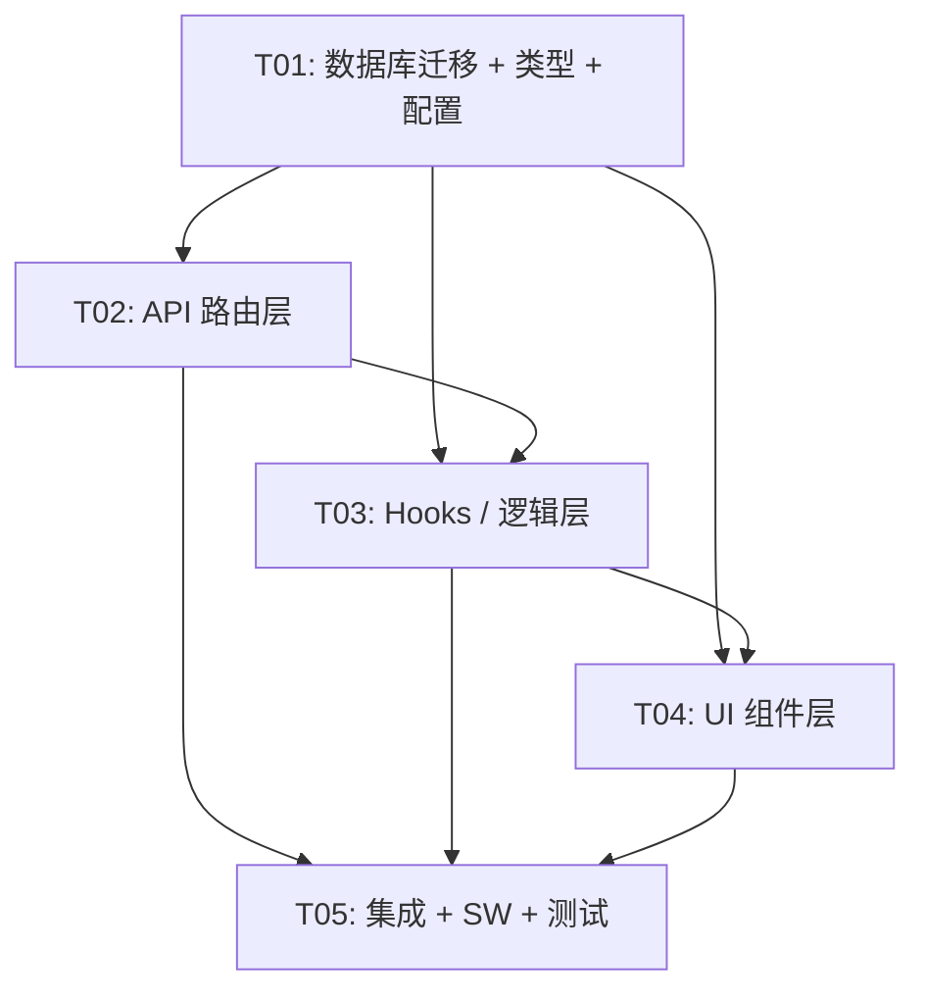

# 架构设计：Supabase Chat 12 项功能增强

> **文档版本**：v1.0
> **创建日期**：2025-06-23
> **项目路径**：`F:\supabase-chat`
> **技术栈**：Next.js 14 (App Router) + Supabase + TypeScript + Tailwind CSS
> **上游文档**：`docs/PRD-12-features.md`

---

## 目录

1. [实现方案与框架选型](#1-实现方案与框架选型)
2. [文件列表及相对路径](#2-文件列表及相对路径)
3. [数据结构与接口定义](#3-数据结构与接口定义)
4. [程序调用流程（时序图）](#4-程序调用流程时序图)
5. [任务列表](#5-任务列表)
6. [依赖包列表](#6-依赖包列表)
7. [共享知识（跨文件约定）](#7-共享知识跨文件约定)
8. [待明确事项](#8-待明确事项)

---

## 1. 实现方案与框架选型

### 1.1 总体架构策略

本次 12 项功能增强在现有架构基础上扩展，**不改变核心技术栈**。整体遵循现有模式：
- **客户端**：React Hooks 组合 + Tailwind CSS 组件，所有 DB 操作通过 API 路由（Service Role Key），客户端 Supabase 仅用于 Realtime Broadcast/Presence
- **服务端**：Next.js API Routes，默认 Edge Runtime，仅 Web Push 推送发送路由使用 Node.js Runtime
- **实时通信**：Supabase Broadcast channel `chat-room:{roomId}` + `room-events` + Presence channel `presence:{roomId}`

### 1.2 各功能实现方案

#### REQ-001：Emoji Reactions（P0）

| 维度 | 方案 |
|------|------|
| **技术路径** | 新增 `reactions` 表（FK → messages ON DELETE CASCADE）。客户端通过 `POST /api/reactions` toggle，通过 `GET /api/reactions?messageIds=...` 批量加载。Realtime 通过现有 `chat-room:{roomId}` channel 新增 `reaction-toggle` 事件广播 |
| **关键挑战** | 消息分页加载时需批量获取回应；撤回消息时 CASCADE 自动清理回应；乐观更新 + 广播的顺序一致性 |
| **新增依赖** | 无 |
| **Runtime** | Edge（API 路由） |

#### REQ-002：链接预览（P0）

| 维度 | 方案 |
|------|------|
| **技术路径** | messages 表新增 `link_preview` JSONB 列缓存抓取结果。客户端检测到 URL 后调用 `POST /api/link-preview`，服务端 `fetch` 目标页面 + 正则解析 OG 标签，5s 超时 + SSRF 防护（禁止内网 IP）。客户端 LRU 缓存（Map 实现，100 条 / 5 分钟 TTL） |
| **关键挑战** | Edge Runtime 中 `fetch` 外部 URL 可用但需注意 DNS 解析限制；SSRF 防护需在 URL 解析后检查 IP 范围；OG 标签正则解析的鲁棒性 |
| **新增依赖** | 无（正则解析，不引入 HTML parser） |
| **Runtime** | Edge（`fetch` 在 Edge Runtime 中可用） |

#### REQ-003：全局搜索（P0）

| 维度 | 方案 |
|------|------|
| **技术路径** | 扩展 `GET /api/messages`，新增 `global/sender/type/startDate/endDate` 参数。`global=true` 时不要求 `roomId`，跨房间搜索并 JOIN rooms 表获取房间名。客户端新增 `SearchModal` 组件 + `useGlobalSearch` hook |
| **关键挑战** | 跨房间搜索的性能（已有 pg_trgm GIN 索引可复用）；搜索结果点击跳转到目标消息（需先 switchRoom 再 scroll）；消息已撤回的判定 |
| **新增依赖** | 无 |
| **Runtime** | Edge |

#### REQ-004：草稿自动保存（P0）

| 维度 | 方案 |
|------|------|
| **技术路径** | 纯客户端 localStorage，key `chat_draft_{roomId}`，值 `{ content, savedAt }`。500ms 防抖写入，7 天过期清理。切换房间时立即保存当前草稿、恢复目标房间草稿。发送后清除 |
| **关键挑战** | 无服务端依赖；需在 `useChat` 中整合草稿逻辑，与现有 `message` state 联动 |
| **新增依赖** | 无 |
| **Runtime** | N/A（纯客户端） |

#### REQ-005：消息日期分隔线（P1）⚠️ 高风险

| 维度 | 方案 |
|------|------|
| **技术路径** | 在 `MessageList` 中构建"分隔线 + 消息"的混合虚拟列表。在 `useVirtualizer` 之前用 `useMemo` 计算出 `virtualItems` 数组（`{ type: 'separator', date } | { type: 'message', message, originalIndex }`）。`count` 改为混合数组长度，`estimateSize` 按 type 区分（separator=40px），`getItemKey` 用 `sep-{date}` 或 `msg-{id}` |
| **关键挑战** | **虚拟列表重构是本次最高风险改动**。需确保：①搜索高亮跳转的 index 映射正确（原 message index → 混合数组 index）；②加载更多历史时新插入的分隔线计算正确；③自动滚动到底部逻辑不受影响；④`measureElement` ref 正确绑定 |
| **新增依赖** | 无 |
| **Runtime** | N/A（纯客户端组件） |

#### REQ-006：置顶消息（P1）

| 维度 | 方案 |
|------|------|
| **技术路径** | rooms 表新增 `pinned_message_id`。扩展 `PUT /api/rooms` 接受 `pinned_message_id` 字段（验证 `created_by === user`）。Realtime `chat-room:{roomId}` channel 新增 `pin-message` 事件。客户端 `PinnedMessageCard` 组件在消息列表顶部显示 |
| **关键挑战** | 置顶消息的完整数据加载（需根据 `pinned_message_id` 查询 messages 表）；置顶消息被撤回时的联动取消 |
| **新增依赖** | 无 |
| **Runtime** | Edge |

#### REQ-007：@提及强提醒（P1）

| 维度 | 方案 |
|------|------|
| **技术路径** | 在 `useMessageRealtime` 的 `chat-message` handler 中，检测 `payload.content` 是否包含 `@{currentUser}`（大小写不敏感精确匹配）。触发不受 `visibilityState` 限制的 `Notification`。侧边栏红点通过 localStorage `chat_mentioned_rooms`（Set<roomId>）。消息中 @昵称 文本高亮（在 `TextMessage` 渲染时正则替换） |
| **关键挑战** | 现有 `notifyNewMessage` 有 `visibilityState` 检查，需新增 `notifyMention` 函数绕过该检查；@匹配的精确性（避免子串匹配）；红点状态的持久化与清除时机 |
| **新增依赖** | 无 |
| **Runtime** | N/A（纯客户端） |

#### REQ-008：1:1 私聊（P1）

| 维度 | 方案 |
|------|------|
| **技术路径** | rooms 表新增 `type` 列（public/dm）。DM 房间 ID 格式 `dm:{userA}:{userB}`（trim 后 `localeCompare` 排序）。新增 `GET /api/dm-list?user={nickname}` 返回当前用户参与的 DM 房间。侧边栏分为"私聊"和"房间"两个区域。Presence 用户列表点击发起 DM |
| **关键挑战** | DM 房间 ID 的双向唯一性保证；DM 房间的创建需 upsert（已存在则直接进入）；侧边栏 UI 重构需兼容现有分组功能（REQ-012） |
| **新增依赖** | 无 |
| **Runtime** | Edge |

#### REQ-009：离线推送 Web Push（P2）

| 维度 | 方案 |
|------|------|
| **技术路径** | 新增 `push_subscriptions` 表。`POST/DELETE /api/push/subscribe` 管理订阅。`POST /api/push/send` 使用 `web-push` 包发送推送（由消息发送 API 内部调用）。扩展 `sw.js` 添加 `push` 和 `notificationclick` 事件。VAPID 密钥对通过环境变量配置 |
| **关键挑战** | **`web-push` 包依赖 Node.js crypto API，不兼容 Edge Runtime**，推送发送路由必须使用 `runtime = 'nodejs'`；VAPID 密钥生成与配置；推送触发逻辑需在 `POST /api/messages` 成功后异步触发（不阻塞消息发送响应） |
| **新增依赖** | `web-push` + `@types/web-push` |
| **Runtime** | `/api/push/send` → **Node.js**；`/api/push/subscribe` → Edge |

#### REQ-010：文件类型扩展（P2）

| 维度 | 方案 |
|------|------|
| **技术路径** | messages 表 type CHECK 新增 `'file'`，新增 `file_name/file_size/file_mime` 列。扩展 `upload-media` API 支持文件类型。新增 `FileMessage` 组件（图标 + 文件名 + 大小 + 下载按钮）。扩展 `config/index.ts` 的 `ALLOWED_FILE_TYPES` |
| **关键挑战** | type CHECK 约束变更需先 DROP 再 ADD；文件下载通过 signed URL + `Content-Disposition: attachment`；文件图标按 MIME 类型映射 |
| **新增依赖** | 无 |
| **Runtime** | Edge |

#### REQ-011：消息转发（P2）

| 维度 | 方案 |
|------|------|
| **技术路径** | messages 表新增 `forwarded_from` JSONB 列（`{ user, room_id, room_name, message_id }`）。上下文菜单新增"转发"选项，弹出 `ForwardDialog` 房间选择器。转发逻辑纯客户端：读取原消息 → 构造新消息（附带 `forwarded_from`）→ 发送到目标房间 |
| **关键挑战** | 媒体消息转发时复制引用（不重新上传文件）；转发后自动切换到目标房间；`forwarded_from` 标记的 UI 展示 |
| **新增依赖** | 无 |
| **Runtime** | Edge（复用现有 `POST /api/messages`） |

#### REQ-012：房间分组（P2）

| 维度 | 方案 |
|------|------|
| **技术路径** | 纯客户端 localStorage `chat_room_groups`（`{ groups: [{ id, name, roomIds: [] }], expanded: { groupId: bool } }`）。`RoomSidebar` 重构为分组渲染，分组可折叠/展开。DM 不受分组影响 |
| **关键挑战** | 分组配置的 CRUD UI；房间拖拽/分配到分组的交互；折叠状态持久化；与 REQ-008 DM 区域的布局协调 |
| **新增依赖** | 无 |
| **Runtime** | N/A（纯客户端） |

### 1.3 Edge Runtime vs Node.js Runtime 路由分配

| API 路由 | Runtime | 原因 |
|----------|---------|------|
| `/api/reactions` | Edge | 标准 Supabase CRUD，无 Node.js 依赖 |
| `/api/link-preview` | Edge | `fetch` 在 Edge Runtime 中可用 |
| `/api/messages` (扩展) | Edge | 保持现有 |
| `/api/rooms` (扩展) | Edge | 保持现有 |
| `/api/dm-list` | Edge | 标准 Supabase 查询 |
| `/api/upload-media` (扩展) | Edge | 保持现有 |
| `/api/push/subscribe` | Edge | 标准 Supabase CRUD |
| `/api/push/send` | **Node.js** | `web-push` 包依赖 Node.js crypto |

---

## 2. 文件列表及相对路径

### 2.1 数据库迁移

| 文件路径 | 操作 | 功能 |
|----------|------|------|
| `supabase/migrations/00006_reactions.sql` | [NEW] | REQ-001: reactions 表 + 索引 + RLS |
| `supabase/migrations/00007_messages_extension.sql` | [NEW] | REQ-002/010/011: messages 表扩展（link_preview, file_*, forwarded_from, type CHECK） + 搜索索引 |
| `supabase/migrations/00008_rooms_extension.sql` | [NEW] | REQ-006/008: rooms 表扩展（pinned_message_id, type） |
| `supabase/migrations/00009_push_subscriptions.sql` | [NEW] | REQ-009: push_subscriptions 表 + 索引 + RLS |

### 2.2 类型定义与配置

| 文件路径 | 操作 | 功能 |
|----------|------|------|
| `src/types/index.ts` | [MODIFY] | 新增 Reaction、LinkPreview、ForwardedFrom、RoomType、PushSubscription 等类型；扩展 Message 接口 |
| `src/config/index.ts` | [MODIFY] | 新增 REACTIONS_CONFIG、LINK_PREVIEW_CONFIG、PUSH_CONFIG、DM_CONFIG；扩展 UPLOAD_CONFIG |

### 2.3 API 路由

| 文件路径 | 操作 | 功能 |
|----------|------|------|
| `src/app/api/reactions/route.ts` | [NEW] | REQ-001: POST(toggle) / GET(批量获取) |
| `src/app/api/link-preview/route.ts` | [NEW] | REQ-002: POST(抓取 OG 标签 + SSRF 防护) |
| `src/app/api/messages/route.ts` | [MODIFY] | REQ-003: GET 扩展全局搜索参数 + JOIN rooms；POST 扩展 file/forwarded_from 字段 |
| `src/app/api/rooms/route.ts` | [MODIFY] | REQ-006: PUT 扩展 pinned_message_id；REQ-008: GET/POST 扩展 type 字段 |
| `src/app/api/dm-list/route.ts` | [NEW] | REQ-008: GET(当前用户 DM 房间列表) |
| `src/app/api/upload-media/route.ts` | [MODIFY] | REQ-010: 扩展文件类型支持 |
| `src/app/api/push/subscribe/route.ts` | [NEW] | REQ-009: POST(保存订阅) / DELETE(取消订阅) |
| `src/app/api/push/send/route.ts` | [NEW] | REQ-009: POST(发送推送, Node.js runtime) |
| `src/lib/ssrf-guard.ts` | [NEW] | REQ-002: SSRF 防护工具（IP 范围检查） |

### 2.4 Hooks / 逻辑层

| 文件路径 | 操作 | 功能 |
|----------|------|------|
| `src/hooks/useReactions.ts` | [NEW] | REQ-001: 回应加载、toggle、Realtime 监听 |
| `src/hooks/useLinkPreview.ts` | [NEW] | REQ-002: URL 检测、预览获取、LRU 缓存 |
| `src/hooks/useGlobalSearch.ts` | [NEW] | REQ-003: 全局搜索（防抖 + 过滤器 + 结果管理） |
| `src/hooks/useDraft.ts` | [NEW] | REQ-004: 草稿自动保存/恢复（防抖 + 7 天过期） |
| `src/hooks/usePinnedMessage.ts` | [NEW] | REQ-006: 置顶消息加载、pin/unpin、Realtime 监听 |
| `src/hooks/useDM.ts` | [NEW] | REQ-008: DM 房间列表、发起 DM |
| `src/hooks/usePushNotification.ts` | [NEW] | REQ-009: 推送订阅管理、权限请求 |
| `src/hooks/useRoomGroups.ts` | [NEW] | REQ-012: 房间分组 CRUD（localStorage） |
| `src/hooks/useMessageRealtime.ts` | [MODIFY] | REQ-001/006/007: 新增 reaction-toggle / pin-message 事件监听；@提及检测 |
| `src/hooks/useChat.ts` | [MODIFY] | 整合所有新 hooks；草稿逻辑；DM 切换；全局搜索跳转 |
| `src/hooks/useFileUpload.ts` | [MODIFY] | REQ-010: 扩展文件类型上传 |
| `src/utils/notifications.ts` | [MODIFY] | REQ-007: 新增 `notifyMention`（不受 visibilityState 限制） |
| `src/utils/date-utils.ts` | [NEW] | REQ-005: 日期格式化（今天/昨天/X月X日 星期X/完整日期） |
| `src/utils/virtual-list-utils.ts` | [NEW] | REQ-005: 混合虚拟列表构建（分隔线 + 消息） |

### 2.5 UI 组件层

| 文件路径 | 操作 | 功能 |
|----------|------|------|
| `src/components/chat/ReactionsBar.tsx` | [NEW] | REQ-001: 回应胶囊栏 + 快捷 emoji 选择器 |
| `src/components/chat/LinkPreviewCard.tsx` | [NEW] | REQ-002: 链接预览卡片（展开/收起） |
| `src/components/chat/SearchModal.tsx` | [NEW] | REQ-003: 全局搜索面板/模态框 |
| `src/components/chat/PinnedMessageCard.tsx` | [NEW] | REQ-006: 置顶消息卡片 |
| `src/components/chat/message-types/FileMessage.tsx` | [NEW] | REQ-010: 文件消息气泡 |
| `src/components/chat/ForwardDialog.tsx` | [NEW] | REQ-011: 转发房间选择器 |
| `src/components/chat/RoomGroupManager.tsx` | [NEW] | REQ-012: 分组管理面板 |
| `src/components/chat/DateSeparator.tsx` | [NEW] | REQ-005: 日期分隔线组件 |
| `src/components/chat/MessageList.tsx` | [MODIFY] | REQ-005: 混合虚拟列表重构；REQ-006: 置顶卡片 |
| `src/components/chat/MessageItem.tsx` | [MODIFY] | REQ-001: 回应栏；REQ-002: 链接预览；REQ-007: @高亮；REQ-010: file 类型；REQ-011: 转发标记 + 菜单 |
| `src/components/chat/RoomSidebar.tsx` | [MODIFY] | REQ-008: DM 区域；REQ-012: 分组渲染；REQ-007: 红点 |
| `src/components/chat/MessageInput.tsx` | [MODIFY] | REQ-004: 草稿恢复指示；REQ-010: 文件上传按钮 |
| `src/components/chat/ChatHeader.tsx` | [MODIFY] | REQ-003: 全局搜索入口；REQ-009: 推送设置入口 |
| `src/app/ChatClient.tsx` | [MODIFY] | 整合所有新组件与 hooks |

### 2.6 Service Worker

| 文件路径 | 操作 | 功能 |
|----------|------|------|
| `public/sw.js` | [MODIFY] | REQ-009: 新增 push / notificationclick 事件 |
| `public/register-sw.js` | [MODIFY] | REQ-009: SW 更新逻辑（如有需要） |

### 2.7 环境变量

| 文件路径 | 操作 | 功能 |
|----------|------|------|
| `.env.example` | [MODIFY] | REQ-009: 新增 VAPID 密钥对变量 |

---

## 3. 数据结构与接口定义

### 3.1 TypeScript 类型定义（新增/扩展）

```typescript
// ============ REQ-001: Emoji Reactions ============

/** 单条回应记录 */
export interface Reaction {
  id: string;
  message_id: string;
  user: string;
  emoji: string;
  created_at: string;
}

/** 按消息分组的回应汇总（前端使用） */
export interface ReactionSummary {
  emoji: string;
  count: number;
  users: string[];
  reactedByMe: boolean;
}

/** message_id → ReactionSummary[] 的映射 */
export type ReactionsMap = Record<string, ReactionSummary[]>;

// ============ REQ-002: 链接预览 ============

/** OG 标签抓取结果 */
export interface LinkPreview {
  url: string;
  title: string;
  description: string;
  image: string;
  fetched_at: string;
}

// ============ REQ-006: 置顶消息 ============

/** 房间信息扩展 */
export interface Room {
  id: string;
  name: string;
  created_by: string;
  created_at: string;
  last_message_at?: string | null;
  pinned_message_id?: string | null;  // [NEW]
  type?: RoomType;                     // [NEW]
}

// ============ REQ-008: 1:1 私聊 ============

export type RoomType = 'public' | 'dm';

/** DM 房间信息 */
export interface DMRoom extends Room {
  type: 'dm';
  participants: string[];  // [userA, userB]
  otherUser: string;       // 对方昵称
}

// ============ REQ-009: Web Push ============

/** 推送订阅记录 */
export interface PushSubscription {
  id: string;
  user: string;
  endpoint: string;
  p256dh: string;
  auth: string;
  created_at: string;
}

// ============ REQ-010: 文件类型扩展 ============

/** Message 接口扩展 */
// 在现有 Message 接口基础上新增以下可选字段：
export interface Message {
  // ... 现有字段 ...
  link_preview?: LinkPreview | null;           // [NEW] REQ-002
  file_name?: string | null;                   // [NEW] REQ-010
  file_size?: number | null;                   // [NEW] REQ-010
  file_mime?: string | null;                   // [NEW] REQ-010
  forwarded_from?: ForwardedFrom | null;       // [NEW] REQ-011
}

// ============ REQ-011: 消息转发 ============

/** 转发来源信息 */
export interface ForwardedFrom {
  user: string;
  room_id: string;
  room_name: string;
  message_id: string;
}

// ============ REQ-012: 房间分组 ============

/** 分组配置 */
export interface RoomGroup {
  id: string;
  name: string;
  roomIds: string[];
}

/** 完整分组存储结构 */
export interface RoomGroupsConfig {
  groups: RoomGroup[];
  expanded: Record<string, boolean>;
}

// ============ REQ-005: 日期分隔线 ============

/** 虚拟列表混合项 */
export type VirtualListItem =
  | { type: 'separator'; date: string; key: string }
  | { type: 'message'; message: Message; originalIndex: number; key: string };
```

### 3.2 数据库表结构

#### reactions 表（00006）

```sql
CREATE TABLE IF NOT EXISTS public.reactions (
    id          TEXT PRIMARY KEY,
    message_id  TEXT NOT NULL REFERENCES public.messages(id) ON DELETE CASCADE,
    "user"      TEXT NOT NULL,
    emoji       TEXT NOT NULL,
    created_at  TIMESTAMPTZ NOT NULL DEFAULT NOW(),
    UNIQUE(message_id, "user", emoji)
);
CREATE INDEX IF NOT EXISTS idx_reactions_message_id ON public.reactions (message_id);
-- RLS: authenticated SELECT / INSERT / DELETE
```

#### messages 表扩展（00007）

```sql
ALTER TABLE public.messages ADD COLUMN IF NOT EXISTS link_preview JSONB;
ALTER TABLE public.messages ADD COLUMN IF NOT EXISTS file_name TEXT;
ALTER TABLE public.messages ADD COLUMN IF NOT EXISTS file_size BIGINT;
ALTER TABLE public.messages ADD COLUMN IF NOT EXISTS file_mime TEXT;
ALTER TABLE public.messages ADD COLUMN IF NOT EXISTS forwarded_from JSONB;
ALTER TABLE public.messages DROP CONSTRAINT IF EXISTS messages_type_check;
ALTER TABLE public.messages ADD CONSTRAINT messages_type_check
    CHECK (type IN ('text', 'image', 'video', 'voice', 'file'));
CREATE INDEX IF NOT EXISTS idx_messages_user ON public.messages ("user");
CREATE INDEX IF NOT EXISTS idx_messages_timestamp ON public.messages (timestamp DESC);
```

#### rooms 表扩展（00008）

```sql
ALTER TABLE public.rooms ADD COLUMN IF NOT EXISTS pinned_message_id TEXT;
ALTER TABLE public.rooms ADD COLUMN IF NOT EXISTS type TEXT NOT NULL DEFAULT 'public'
    CHECK (type IN ('public', 'dm'));
```

#### push_subscriptions 表（00009）

```sql
CREATE TABLE IF NOT EXISTS public.push_subscriptions (
    id          TEXT PRIMARY KEY,
    "user"      TEXT NOT NULL,
    endpoint    TEXT NOT NULL,
    p256dh      TEXT NOT NULL,
    auth        TEXT NOT NULL,
    created_at  TIMESTAMPTZ NOT NULL DEFAULT NOW(),
    UNIQUE("user", endpoint)
);
CREATE INDEX IF NOT EXISTS idx_push_subscriptions_user ON public.push_subscriptions ("user");
-- RLS: authenticated ALL
```

### 3.3 API 路由签名

#### POST /api/reactions — Toggle 回应

```
Request:  { message_id: string, user: string, emoji: string }
Response: { success: boolean, action: 'added' | 'removed' }
```

#### GET /api/reactions?messageIds=id1,id2 — 批量获取回应

```
Response: { success: boolean, reactions: Record<message_id, Reaction[]> }
```

#### POST /api/link-preview — 抓取链接预览

```
Request:  { url: string, message_id?: string }
Response: { success: boolean, preview?: { title, description, image } }
失败时:   { success: false } (静默失败)
```

#### GET /api/messages (扩展) — 全局搜索

```
新增参数: global=true, sender=string, type=text|image|video|voice|file,
          startDate=ISO8601, endDate=ISO8601
当 global=true 时不要求 roomId，返回结果包含 room_id + room_name
Response: { success: boolean, messages: (Message & { room_id?, room_name? })[] }
```

#### POST /api/messages (扩展) — 发送消息

```
新增字段: file_name?, file_size?, file_mime?, forwarded_from?
type 验证新增 'file'
```

#### PUT /api/rooms (扩展) — 置顶/取消置顶

```
新增字段: pinned_message_id?: string | null
验证: rooms.created_by === user (仅创建者可操作)
```

#### GET /api/rooms (扩展) — 房间列表

```
新增参数: type=public|dm (可选过滤)
返回结果包含 type, pinned_message_id 字段
```

#### POST /api/rooms (扩展) — 创建房间

```
新增字段: type?: 'public' | 'dm', participants?: string[]
当 type='dm' 时，id 使用 dm:{userA}:{userB} 格式
```

#### GET /api/dm-list?user={nickname} — DM 房间列表

```
Response: { success: boolean, rooms: DMRoom[] }
```

#### POST /api/push/subscribe — 保存推送订阅

```
Request:  { user: string, endpoint: string, keys: { p256dh: string, auth: string } }
Response: { success: boolean }
Runtime:  Edge
```

#### DELETE /api/push/subscribe — 取消推送订阅

```
Request:  { user: string, endpoint: string }
Response: { success: boolean }
Runtime:  Edge
```

#### POST /api/push/send — 发送推送（内部调用）

```
Request:  { user: string, title: string, body: string, url: string }
Response: { success: boolean }
Runtime:  Node.js (web-push 包依赖)
```

### 3.4 类图（Mermaid）

> 完整类图见 `docs/class-diagram.mermaid`



---

## 4. 程序调用流程（时序图）

> 完整时序图见 `docs/sequence-diagram.mermaid`

### 4.1 Emoji Reaction Toggle 流程



### 4.2 链接预览抓取流程



### 4.3 全局搜索流程



### 4.4 1:1 DM 发起流程



### 4.5 Web Push 推送流程



---

## 5. 任务列表

> 以下任务按实现顺序排列，工程师按序执行。同一任务内的文件可并行开发。

### T01：数据库迁移 + 类型定义 + 配置（基础设施）

| 属性 | 值 |
|------|-----|
| **任务编号** | T01 |
| **任务标题** | 数据库迁移 + 类型定义 + 配置 |
| **依赖任务** | 无 |
| **预计复杂度** | 中等 |
| **优先级** | P0 |

**涉及文件**：
- `supabase/migrations/00006_reactions.sql` [NEW]
- `supabase/migrations/00007_messages_extension.sql` [NEW]
- `supabase/migrations/00008_rooms_extension.sql` [NEW]
- `supabase/migrations/00009_push_subscriptions.sql` [NEW]
- `src/types/index.ts` [MODIFY]
- `src/config/index.ts` [MODIFY]
- `.env.example` [MODIFY]

**任务描述**：
1. 创建 4 个 SQL 迁移文件：
   - `00006_reactions.sql`：reactions 表（id, message_id FK CASCADE, user, emoji, created_at, UNIQUE 约束）+ 索引 + RLS（authenticated SELECT/INSERT/DELETE）
   - `00007_messages_extension.sql`：messages 表新增 link_preview JSONB / file_name TEXT / file_size BIGINT / file_mime TEXT / forwarded_from JSONB；DROP + ADD type CHECK 约束（新增 'file'）；新增 idx_messages_user / idx_messages_timestamp 索引
   - `00008_rooms_extension.sql`：rooms 表新增 pinned_message_id TEXT / type TEXT DEFAULT 'public' CHECK (public/dm)
   - `00009_push_subscriptions.sql`：push_subscriptions 表 + 索引 + RLS
2. 扩展 `src/types/index.ts`：新增 Reaction / ReactionSummary / ReactionsMap / LinkPreview / ForwardedFrom / RoomType / DMRoom / PushSubscription / RoomGroup / RoomGroupsConfig / VirtualListItem 类型；扩展 Message 接口（link_preview / file_name / file_size / file_mime / forwarded_from）；扩展 Room 接口（pinned_message_id / type）
3. 扩展 `src/config/index.ts`：新增 REACTIONS_CONFIG（常用 emoji 列表）、LINK_PREVIEW_CONFIG（超时 5s / LRU 上限 100 / TTL 5min）、DM_CONFIG（ID 前缀）、PUSH_CONFIG（VAPID 环境变量引用）；扩展 UPLOAD_CONFIG.ALLOWED_FILE_TYPES 新增文档/压缩文件 MIME 类型
4. 更新 `.env.example`：新增 `NEXT_PUBLIC_VAPID_PUBLIC_KEY` / `VAPID_PRIVATE_KEY` / `VAPID_SUBJECT`

**验收标准**：
- 4 个迁移文件可在 Supabase SQL Editor 中顺序执行无报错
- TypeScript 类型编译无错误（`npx tsc --noEmit`）
- 现有功能不受影响（迁移为纯 ADD COLUMN，向后兼容）

---

### T02：API 路由层（全部 API 端点）

| 属性 | 值 |
|------|-----|
| **任务编号** | T02 |
| **任务标题** | API 路由层 |
| **依赖任务** | T01 |
| **预计复杂度** | 复杂 |
| **优先级** | P0 |

**涉及文件**：
- `src/app/api/reactions/route.ts` [NEW]
- `src/app/api/link-preview/route.ts` [NEW]
- `src/app/api/dm-list/route.ts` [NEW]
- `src/app/api/push/subscribe/route.ts` [NEW]
- `src/app/api/push/send/route.ts` [NEW]
- `src/app/api/messages/route.ts` [MODIFY]
- `src/app/api/rooms/route.ts` [MODIFY]
- `src/app/api/upload-media/route.ts` [MODIFY]
- `src/lib/ssrf-guard.ts` [NEW]

**任务描述**：
1. **`/api/reactions`** [NEW]：
   - POST：toggle 语义。接收 `{ message_id, user, emoji }`，先 SELECT 查 UNIQUE 约束，存在则 DELETE，不存在则 INSERT。返回 `{ success, action: 'added'|'removed' }`
   - GET：接收 `?messageIds=id1,id2`，批量查询 reactions 表，返回 `Record<message_id, Reaction[]>`。Edge runtime
2. **`/api/link-preview`** [NEW]：
   - POST：接收 `{ url, message_id? }`。调用 `ssrf-guard.ts` 校验 URL（仅 http/https，禁止内网 IP）。通过后 `fetch` 目标 URL（5s 超时，User-Agent 伪装），正则解析 `og:title` / `og:description` / `og:image`。若 `message_id` 存在则 UPDATE messages SET link_preview。返回 `{ success, preview? }`。Edge runtime
3. **`src/lib/ssrf-guard.ts`** [NEW]：
   - 导出 `isUrlSafe(url: string): boolean`：解析 URL，检查协议白名单（http/https），解析 hostname，检查 IP 范围（拒绝 10.x / 172.16-31.x / 192.168.x / 127.x / localhost / IPv6 ULA / link-local）
4. **`/api/messages`** [MODIFY]：
   - GET 扩展：新增 `global` / `sender` / `type` / `startDate` / `endDate` 参数。当 `global=true` 时不要求 roomId，移除 roomId 必填校验，跨房间搜索并 LEFT JOIN rooms 获取 room_name。sender 用 ILIKE，type 用 eq，startDate/endDate 用 gte/lte on timestamp
   - POST 扩展：`validTypes` 新增 `'file'`；新增 `file_name` / `file_size` / `file_mime` / `forwarded_from` 字段写入。**若消息包含 @某用户且该用户有 push 订阅，异步触发推送**（fetch `/api/push/send`，不阻塞响应）
5. **`/api/rooms`** [MODIFY]：
   - GET 扩展：支持 `?type=public|dm` 过滤；返回结果包含 `type` 和 `pinned_message_id` 字段
   - POST 扩展：支持 `type: 'dm'` + `participants` + 自定义 `id`（DM 房间 ID）。DM 创建使用 `ON CONFLICT (id) DO NOTHING`（幂等）
   - PUT 扩展：新增 `pinned_message_id` 字段（传 null 取消置顶）。验证 `rooms.created_by === user`，非创建者返回 403
6. **`/api/dm-list`** [NEW]：
   - GET：接收 `?user={nickname}`，查询 `rooms WHERE type='dm' AND (created_by = user OR name = user)`，返回 DM 房间列表。Edge runtime
7. **`/api/upload-media`** [MODIFY]：
   - 扩展 `ALLOWED_FILE_TYPES` 校验逻辑，新增文档/压缩文件类型。文件上传不进行压缩处理（与图片不同）
8. **`/api/push/subscribe`** [NEW]：
   - POST：接收 `{ user, endpoint, keys: { p256dh, auth } }`，INSERT 到 push_subscriptions（`ON CONFLICT (user, endpoint) DO NOTHING`）。Edge runtime
   - DELETE：接收 `{ user, endpoint }`，DELETE FROM push_subscriptions。Edge runtime
9. **`/api/push/send`** [NEW]：
   - POST：接收 `{ user, title, body, url }`。查询用户的所有 push_subscriptions，使用 `web-push` 包的 `sendNotification` 发送推送。**`export const runtime = 'nodejs'`**。配置 VAPID 密钥对（`VAPID_PRIVATE_KEY` / `VAPID_SUBJECT`）

**验收标准**：
- 所有 Edge runtime 路由不使用 Node.js 专有 API
- `/api/push/send` 标注 `runtime = 'nodejs'` 且可正常调用 `web-push`
- SSRF 防护正确拦截内网 URL（测试 127.0.0.1 / 10.0.0.1 / 192.168.1.1 等均被拒绝）
- 现有 messages/rooms API 的原有功能不受影响（向后兼容）

---

### T03：Hooks / 逻辑层（全部 hooks + 工具函数）

| 属性 | 值 |
|------|-----|
| **任务编号** | T03 |
| **任务标题** | Hooks / 逻辑层 |
| **依赖任务** | T01, T02 |
| **预计复杂度** | 复杂 |
| **优先级** | P0 |

**涉及文件**：
- `src/hooks/useReactions.ts` [NEW]
- `src/hooks/useLinkPreview.ts` [NEW]
- `src/hooks/useGlobalSearch.ts` [NEW]
- `src/hooks/useDraft.ts` [NEW]
- `src/hooks/usePinnedMessage.ts` [NEW]
- `src/hooks/useDM.ts` [NEW]
- `src/hooks/usePushNotification.ts` [NEW]
- `src/hooks/useRoomGroups.ts` [NEW]
- `src/hooks/useMessageRealtime.ts` [MODIFY]
- `src/hooks/useChat.ts` [MODIFY]
- `src/hooks/useFileUpload.ts` [MODIFY]
- `src/utils/notifications.ts` [MODIFY]
- `src/utils/date-utils.ts` [NEW]
- `src/utils/virtual-list-utils.ts` [NEW]

**任务描述**：
1. **`useReactions`** [NEW]：管理 `reactionsMap: ReactionsMap` state。`loadReactions(messageIds)` 批量 GET。`toggleReaction(messageId, emoji)` 乐观更新 + POST + broadcast。监听 `reaction-toggle` 事件更新本地 state。在 `useMessageRealtime` 中注册监听
2. **`useLinkPreview`** [NEW]：管理 LRU 缓存（Map, 100 条, 5min TTL）。`getPreview(url, messageId)` 先查缓存再调 API。导出 `extractUrls(content): string[]` 工具函数（正则匹配 `https?://` 裸 URL + Markdown `[text](url)`）
3. **`useGlobalSearch`** [NEW]：管理搜索 state（keyword / filters / results / loading）。300ms 防抖。`search()` 调用扩展后的 GET /api/messages。`onResultClick(message)` 回调触发 switchRoom + scrollToMessage
4. **`useDraft`** [NEW]：`saveDraft(roomId, content)` 500ms 防抖写入 localStorage `chat_draft_{roomId}`（含 savedAt 时间戳）。`loadDraft(roomId)` 读取并检查 7 天过期。`clearDraft(roomId)` 发送后调用。在 `useChat` 中整合：切换房间时 saveDraft(currentRoom) + loadDraft(newRoom)
5. **`usePinnedMessage`** [NEW]：`pinnedMessage: Message | null` state。`loadPinned(room)` 从 rooms.pinned_message_id 查询完整消息。`pinMessage(messageId)` / `unpinMessage()` 调用 PUT /api/rooms。监听 `pin-message` 事件更新。撤回消息时联动取消置顶
6. **`useDM`** [NEW]：`dmRooms: DMRoom[]` state。`loadDMs()` 调用 GET /api/dm-list。`startDM(userA, userB)` 生成 ID + POST /api/rooms + 刷新列表。ID 生成：`'dm:' + [a, b].sort((x,y) => x.localeCompare(y)).join(':')`
7. **`usePushNotification`** [NEW]：`isPushEnabled: boolean` state。`enablePush()` 请求 Notification 权限 → pushManager.subscribe → POST /api/push/subscribe。`disablePush()` 取消订阅 → DELETE /api/push/subscribe。读取 `NEXT_PUBLIC_VAPID_PUBLIC_KEY` 环境变量
8. **`useRoomGroups`** [NEW]：`groupsConfig: RoomGroupsConfig` state（localStorage `chat_room_groups`）。`createGroup(name)` / `renameGroup(id, name)` / `deleteGroup(id)` / `assignRoom(roomId, groupId)` / `toggleGroup(id)`。初始化时读取 localStorage，变更时写入
9. **`useMessageRealtime`** [MODIFY]：
   - 新增 `reaction-toggle` 事件监听：更新 reactionsMap（需通过回调或共享 state）
   - 新增 `pin-message` 事件监听：`{ roomId, messageId | null }`，触发 usePinnedMessage 刷新
   - 在 `chat-message` handler 中新增 @提及检测：`payload.content` 匹配 `@{currentUser}`（大小写不敏感精确匹配，trim 后比较），触发 `notifyMention` + localStorage 红点
10. **`useChat`** [MODIFY]：
    - 整合 useDraft（切换房间时 save/load）
    - 整合 useDM（DM 列表 + startDM）
    - 整合 useGlobalSearch（搜索 + 跳转回调）
    - 整合 usePinnedMessage（置顶消息加载）
    - 整合 useRoomGroups（分组配置）
    - 新增 `scrollToMessageId` state（用于全局搜索跳转后滚动到目标消息）
    - `sendText` 清除草稿
11. **`useFileUpload`** [MODIFY]：扩展 `handleFileChange` 支持文件类型（非图片/视频/音频的文件走 file 上传逻辑，不压缩），构造 file 类型 Message（含 file_name / file_size / file_mime）
12. **`notifications.ts`** [MODIFY]：新增 `notifyMention(roomName: string, sender: string, content: string)` 函数。与现有 `notifyNewMessage` 的区别：**不检查 `document.visibilityState`**，始终显示 Notification + 播放提示音
13. **`date-utils.ts`** [NEW]：
    - `formatDateSeparator(date: Date): string`：今天 → "今天"，昨天 → "昨天"，同年 → "X月X日 星期X"，跨年 → "YYYY年X月X日 星期X"
    - `getDateKey(timestamp: string): string`：返回 YYYY-MM-DD 格式用于分隔线去重
    - `isSameDay(a: string, b: string): boolean`
14. **`virtual-list-utils.ts`** [NEW]：
    - `buildVirtualList(messages: Message[]): VirtualListItem[]`：遍历 messages，当与前一条消息不在同一天时插入 `{ type: 'separator', date, key: 'sep-{dateKey}' }`，否则插入 `{ type: 'message', message, originalIndex, key: 'msg-{id}' }`
    - `estimateItemSize(item: VirtualListItem): number`：separator → 40，message → 按 type 估算（复用现有逻辑）

**验收标准**：
- 所有 hooks 遵循现有模式（`'use client'` + useCallback/useRef + 返回对象）
- useMessageRealtime 的新事件监听不破坏现有 chat-message/withdraw/edit/typing/room-deleted 逻辑
- useDraft 的草稿在切换房间、刷新页面后正确恢复，发送后清除
- useDM 的 ID 生成保证 `startDM(A, B)` 和 `startDM(B, A)` 生成相同 roomId
- @提及检测不误触发（不匹配子串，仅精确匹配 @完整昵称）

---

### T04：UI 组件层（全部组件）

| 属性 | 值 |
|------|-----|
| **任务编号** | T04 |
| **任务标题** | UI 组件层 |
| **依赖任务** | T01, T03 |
| **预计复杂度** | 复杂 |
| **优先级** | P0 |

**涉及文件**：
- `src/components/chat/ReactionsBar.tsx` [NEW]
- `src/components/chat/LinkPreviewCard.tsx` [NEW]
- `src/components/chat/SearchModal.tsx` [NEW]
- `src/components/chat/PinnedMessageCard.tsx` [NEW]
- `src/components/chat/message-types/FileMessage.tsx` [NEW]
- `src/components/chat/ForwardDialog.tsx` [NEW]
- `src/components/chat/RoomGroupManager.tsx` [NEW]
- `src/components/chat/DateSeparator.tsx` [NEW]
- `src/components/chat/MessageList.tsx` [MODIFY]
- `src/components/chat/MessageItem.tsx` [MODIFY]
- `src/components/chat/RoomSidebar.tsx` [MODIFY]
- `src/components/chat/MessageInput.tsx` [MODIFY]
- `src/components/chat/ChatHeader.tsx` [MODIFY]

**任务描述**：
1. **`ReactionsBar`** [NEW]：渲染 `ReactionSummary[]`（emoji + count 胶囊，按 count 降序）。当前用户已添加的 emoji 高亮（蓝色边框）。点击胶囊触发 toggle。无回应时不渲染。点击"+"弹出常用 emoji 快捷栏（8-12 个）
2. **`LinkPreviewCard`** [NEW]：收起态：缩略图（48x48）+ 标题（单行截断）。展开态：缩略图 + 标题 + 描述（3 行截断）。加载中：骨架屏。点击卡片新标签页打开 URL。Props: `{ preview: LinkPreview }`
3. **`SearchModal`** [NEW]：全屏搜索面板。搜索输入框（300ms 防抖）+ 高级筛选（发送人输入 / 类型下拉 / 日期范围选择器）。结果列表：内容摘要（关键词高亮）+ 发送人 + 房间名标签 + 时间。点击结果触发 `onResultClick(message)`
4. **`PinnedMessageCard`** [NEW]：浅黄色背景 + 图钉图标 + "置顶消息"标签 + 内容摘要（2 行截断）+ 发送人 + 时间。点击跳转到原消息位置。右上角关闭按钮（仅收起显示，不取消置顶）。Props: `{ message: Message, onJumpTo: () => void, onDismiss: () => void }`
5. **`FileMessage`** [NEW]：横向布局：文件类型图标（32x32，按 MIME 着色）+ 文件名 + 文件大小（友好格式）+ 下载按钮。下载通过 signed URL。Props: `{ message: Message, isSelf: boolean }`
6. **`ForwardDialog`** [NEW]：底部弹出面板 / 居中弹窗。列表展示所有房间 + DM，支持搜索过滤。选择后触发 `onSelect(roomId)`。Props: `{ rooms: Room[], dmRooms: DMRoom[], onSelect: (roomId: string) => void, onClose: () => void }`
7. **`RoomGroupManager`** [NEW]：分组管理面板。创建/重命名/删除分组（分组名最长 20 字符）。房间列表可分配到分组。Props: `{ groupsConfig, onCreateGroup, onRenameGroup, onDeleteGroup, onAssignRoom }`
8. **`DateSeparator`** [NEW]：全宽水平线 + 居中日期文本。样式：`——— 今天 ———`。Props: `{ date: string }`
9. **`MessageList`** [MODIFY] ⚠️ **高风险**：
    - 引入 `buildVirtualList` 将 messages 转换为 `VirtualListItem[]`
    - `useVirtualizer` 的 `count` 改为 `virtualItems.length`
    - `estimateSize` 改为接收 `VirtualListItem`，separator 返回 40
    - `getItemKey` 改为 `item.key`
    - 渲染逻辑：separator → `<DateSeparator>`，message → 现有 `<MessageItem>`
    - `searchHighlightId` 的 index 映射：通过 `virtualItems.findIndex(i => i.type === 'message' && i.message.id === id)` 转换
    - 自动滚动到底部：`virtualItems.length - 1`（可能是 separator 或 message）
    - 新增 `PinnedMessageCard` 在列表顶部（加载更多指示器下方）
10. **`MessageItem`** [MODIFY]：
    - 新增 `ReactionsBar` 在消息气泡下方
    - 新增 `LinkPreviewCard` 在文本消息下方（检测到 URL 时）
    - 新增 `forwarded_from` 标记（"转发自 @原发送人"灰色小字）
    - 上下文菜单新增："回应"（弹出 emoji 快捷栏）、"转发"（弹出 ForwardDialog）、"置顶"/"取消置顶"（仅房间创建者可见）
    - type='file' 时渲染 `FileMessage`
    - @昵称 文本高亮（在 TextMessage 中正则替换为高亮 span）
    - 被提及的消息气泡左侧橙色竖线
11. **`RoomSidebar`** [MODIFY]：
    - 新增"私聊"区域（顶部，DM 房间列表，首字母头像 + 对方昵称 + 在线状态绿点）
    - 房间区域支持分组渲染（分组标题行：折叠箭头 + 分组名 + 房间数量；折叠/展开动画）
    - 未分组房间显示在"全部"区域
    - DM 不受分组影响
    - @提及红点（红色，比普通未读蓝点更大 4px）
    - 底部新增"管理分组"按钮
    - 在线用户列表（Presence）点击用户头像 → "发起私聊"操作
12. **`MessageInput`** [MODIFY]：
    - 草稿恢复指示器（右下角极小"已保存"文字，2s 淡出）
    - 新增文件上传按钮（与图片/视频/语音并列）
13. **`ChatHeader`** [MODIFY]：
    - 新增全局搜索入口（放大镜图标，与现有房间内搜索区分）
    - 新增推送设置入口（齿轮图标 → 推送开关面板）

**验收标准**：
- MessageList 虚拟列表重构后，现有功能（自动滚动、搜索高亮跳转、加载更多、上传进度）全部正常
- 日期分隔线正确显示（今天/昨天/X月X日 星期X/跨年完整日期）
- 回应胶囊实时同步（延迟 < 500ms）
- 链接预览卡片正确显示/收起/展开
- @提及高亮 + 红点 + 通知
- DM 发起后侧边栏正确显示
- 置顶消息卡片正确显示，创建者可置顶/取消
- 转发流程完整（选择房间 → 转发 → 切换到目标房间 → 显示转发标记）
- 文件消息正确显示（图标 + 名称 + 大小 + 下载）
- 房间分组创建/折叠/展开正常

---

### T05：集成 + Service Worker + 测试

| 属性 | 值 |
|------|-----|
| **任务编号** | T05 |
| **任务标题** | 集成 + Service Worker + 测试 |
| **依赖任务** | T01, T02, T03, T04 |
| **预计复杂度** | 中等 |
| **优先级** | P0 |

**涉及文件**：
- `src/app/ChatClient.tsx` [MODIFY]
- `public/sw.js` [MODIFY]
- `public/register-sw.js` [MODIFY]
- `src/__tests__/` 下新增测试文件 [NEW]

**任务描述**：
1. **`ChatClient.tsx`** [MODIFY]：
    - 从 `useChat` 解构新增的 state/方法（draftState, dmRooms, globalSearchState, pinnedMessage, groupsConfig, pushState 等）
    - 集成 `SearchModal`（全局搜索入口触发）
    - 集成 `PinnedMessageCard`（传入 MessageList 或在 ChatClient 中渲染）
    - 集成 `ForwardDialog`（MessageItem 转发操作触发）
    - 集成 `RoomGroupManager`（RoomSidebar 管理分组触发）
    - 传递 `scrollToMessageId` 给 MessageList（全局搜索跳转）
    - 传递 `reactionsMap` / `onToggleReaction` 给 MessageList → MessageItem
    - 传递 `pinnedMessage` / `onPinMessage` / `onUnpinMessage` 给 MessageList
2. **`sw.js`** [MODIFY]：
    - 新增 `push` 事件监听：解析 `event.data.json()`，调用 `self.registration.showNotification(title, { body, icon, badge, data: { url }, tag: 'chat-push' })`
    - 新增 `notificationclick` 事件监听：`event.notification.close()` + `clients.openWindow(url || '/')`
    - 保持现有 install/activate/fetch 逻辑不变
3. **`register-sw.js`** [MODIFY]：
    - 确认 `skipWaiting` + `clients.claim` 逻辑正常（已有），确保 SW 更新后 push 事件监听生效
4. **测试**：
    - 单元测试：`date-utils.ts`（日期格式化各种边界）、`virtual-list-utils.ts`（分隔线插入逻辑）、`ssrf-guard.ts`（IP 范围拦截）、DM ID 生成（双向唯一性）
    - 集成测试：reactions toggle 流程、草稿保存/恢复、全局搜索跳转、DM 发起

**验收标准**：
- ChatClient 正确整合所有新功能，无 TypeScript 类型错误
- Service Worker push 事件正确触发通知
- notificationclick 正确打开应用并跳转到对应房间
- 所有单元测试通过（`npx vitest run`）
- 现有功能（消息发送/接收/撤回/编辑/搜索/房间管理/文件上传）全部正常
- 移动端和桌面端 UI 均正常显示

---

### 任务依赖关系图



---

## 6. 依赖包列表

### 新增 npm 包

| 包名 | 版本 | 用途 | 安装命令 |
|------|------|------|---------|
| `web-push` | `^3.6.7` | Web Push 推送发送（REQ-009） | `npm install web-push` |
| `@types/web-push` | `^3.6.4` | web-push 类型定义（devDependency） | `npm install -D @types/web-push` |

### 现有依赖（无需变更）

以下包已在项目中安装，本次功能增强直接复用：
- `@supabase/supabase-js` — Supabase 客户端（Realtime + DB + Storage）
- `@tanstack/react-virtual` — 虚拟滚动（REQ-005 重构）
- `react-markdown` / `react-syntax-highlighter` — Markdown 渲染（@提及高亮扩展）
- `lucide-react` — 图标组件（新增图标：Pin、Forward、File 等）
- `sonner` — Toast 通知
- `next-themes` — 主题切换
- `Compressor.js` — 图片压缩（文件上传不使用）

---

## 7. 共享知识（跨文件约定）

### 7.1 命名规范

| 类别 | 规范 | 示例 |
|------|------|------|
| **文件命名** | kebab-case（API 路由） / PascalCase（组件） / camelCase（hooks/utils） | `link-preview/route.ts`, `ReactionsBar.tsx`, `useReactions.ts` |
| **TypeScript 类型** | PascalCase | `ReactionSummary`, `LinkPreview`, `ForwardedFrom` |
| **数据库列名** | snake_case | `message_id`, `pinned_message_id`, `file_name` |
| **API 参数** | camelCase（JSON body） / snake_case（与 DB 列名对齐） | `message_id`, `roomId`（URL param） |
| **React 组件 Props** | PascalCase 接口名 + camelCase 字段 | `ReactionsBarProps`, `messageId` |

### 7.2 Broadcast Event 命名规范

所有 Realtime Broadcast 事件在现有 `chat-room:{roomId}` channel 上发送（除非特别说明）：

| 事件名 | Payload | 方向 | 功能 |
|--------|---------|------|------|
| `chat-message` | `Message` | 现有 | 新消息 |
| `withdraw-message` | `{ id }` | 现有 | 撤回消息 |
| `edit-message` | `{ id, content, edited_at }` | 现有 | 编辑消息 |
| `typing-start` | `{ user }` | 现有 | 正在输入 |
| `typing-stop` | `{ user }` | 现有 | 停止输入 |
| `reaction-toggle` | `{ message_id, user, emoji, action: 'add'\|'remove' }` | **新增** | 回应切换 |
| `pin-message` | `{ roomId, messageId: string \| null }` | **新增** | 置顶/取消置顶 |
| `room-deleted` | `{ roomId }` | 现有（`room-events` channel） | 房间删除 |

### 7.3 localStorage Key 命名规范

| Key | 结构 | 功能 | 过期策略 |
|-----|------|------|---------|
| `chat_nickname` | `string` | 现有：昵称 | 永久 |
| `chat_theme` | `string` | 现有：主题 | 永久 |
| `chat_last_seen` | `Record<roomId, ISO8601>` | 现有：最后查看时间 | 永久 |
| `chat_messages_v1_{roomId}` | `Message[]` | 现有：消息缓存 | 永久 |
| `chat_draft_{roomId}` | `{ content: string, savedAt: ISO8601 }` | **新增** REQ-004：草稿 | 7 天 |
| `chat_mentioned_rooms` | `string[]` (roomId 数组) | **新增** REQ-007：@提及红点 | 查看后清除 |
| `chat_room_groups` | `RoomGroupsConfig` | **新增** REQ-012：房间分组 | 永久 |

### 7.4 API 响应格式约定

所有 API 路由统一使用以下响应格式（与现有约定一致）：

```typescript
// 成功响应
{
  "success": true,
  // ... 业务数据字段
}

// 失败响应
{
  "success": false,
  "message": "错误描述（中文）"
}
```

HTTP 状态码约定：
- `200` — 成功
- `400` — 参数错误
- `403` — 权限不足
- `404` — 资源不存在
- `413` — 文件过大
- `415` — 不支持的文件类型
- `500` — 服务器内部错误

### 7.5 Edge Runtime 约定

- 所有 API 路由默认 `export const runtime = 'edge'`（与现有约定一致）
- **例外**：`/api/push/send` 必须使用 `export const runtime = 'nodejs'`（web-push 依赖 Node.js crypto）
- Edge Runtime 中不可使用：`fs`、`path`、`crypto`（Node.js 版本）、`Buffer`（部分场景）
- Edge Runtime 中可用：`fetch`、`Request`/`Response`、`URL`、`TextEncoder/Decoder`、`crypto.subtle`（Web Crypto API）

### 7.6 Supabase 客户端使用约定

- **客户端**（`src/lib/supabase.ts`）：仅用于 Realtime Broadcast/Presence，使用 Publishable key，不直接访问 DB
- **服务端**（API 路由内 `getClient()`）：使用 Service Role Key 访问 DB/Storage，每次请求创建新 client
- 所有 DB 读写通过 API 路由中转，客户端不直接执行 `.from().select()` 等 DB 操作

---

## 8. 待明确事项

| # | 问题 | 影响范围 | 当前假设 | 建议确认方 |
|---|------|---------|---------|-----------|
| 1 | **VAPID 密钥对是否已生成**：Web Push 需要提前通过 `npx web-push generate-vapid-keys` 生成密钥对并配置到环境变量 | REQ-009 (T02/T05) | 假设工程师在 T02 执行时自行生成 | 需与团队确认是否已有密钥对，或由运维提供 |
| 2 | **Supabase 项目是否已启用 pg_trgm 扩展**：全局搜索依赖已有的 GIN trigram 索引（00005 迁移） | REQ-003 (T01) | 假设已启用（00005 迁移已创建索引） | 确认 Supabase 项目中 pg_trgm 扩展状态 |
| 3 | **DM 房间的消息在全局搜索中的可见性**：PRD 要求 DM 不参与全局搜索，但实现上需要额外过滤 | REQ-003 + REQ-008 (T02) | 假设全局搜索 `global=true` 时 `WHERE r.type != 'dm' OR r.type IS NULL` | 确认是否完全排除 DM |
| 4 | **推送触发的时机**：PRD 提到 @提及 优先推送，非 @消息可配置。当前设计在 POST /api/messages 中检测 @并触发推送 | REQ-009 (T02) | 假设初始版本仅推送 @提及 消息，后续再加"全部消息推送"开关 | 确认初始版本推送策略 |
| 5 | **文件下载的 signed URL Content-Disposition**：PRD 要求文件下载设置 `Content-Disposition: attachment`，但 Supabase Storage 的 signed URL 是否支持此参数需确认 | REQ-010 (T02/T04) | 假设通过 signed URL 的 `response-content-disposition` query param 实现 | 需验证 Supabase Storage API 是否支持 |
| 6 | **虚拟列表重构的兼容性测试**：REQ-005 是最高风险改动，是否需要额外的回归测试覆盖 | REQ-005 (T04/T05) | 假设在 T05 中进行手动回归测试 + 关键路径单元测试 | 确认是否需要更全面的 E2E 测试 |
| 7 | **rooms 表 type 列的 DEFAULT 迁移**：现有 rooms 表已有数据，新增 `type TEXT NOT NULL DEFAULT 'public'` 时，已有行会自动填充 'public'。但需确认 Supabase PostgreSQL 版本支持此行为 | REQ-008 (T01) | 假设标准 PostgreSQL 行为（ADD COLUMN ... DEFAULT 自动填充已有行） | 低风险，标准 SQL 行为 |
| 8 | **Emoji Reactions 的快捷 emoji 列表**：PRD 建议 8-12 个，具体列表需确认 | REQ-001 (T04) | 假设使用 👍 ❤️ 😂 🎉 🔥 😮 😢 🙏 (8 个) | 可由 PM 或设计师确认最终列表 |

---

## 附录：Mermaid 图表文件

本文档中的类图和时序图已提取到独立文件：
- 类图：`docs/class-diagram.mermaid`
- 时序图：`docs/sequence-diagram.mermaid`
