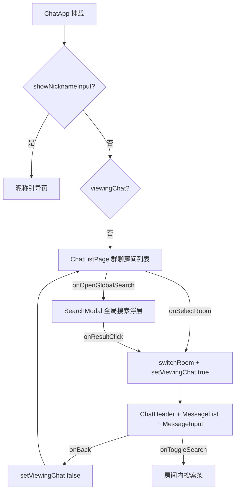
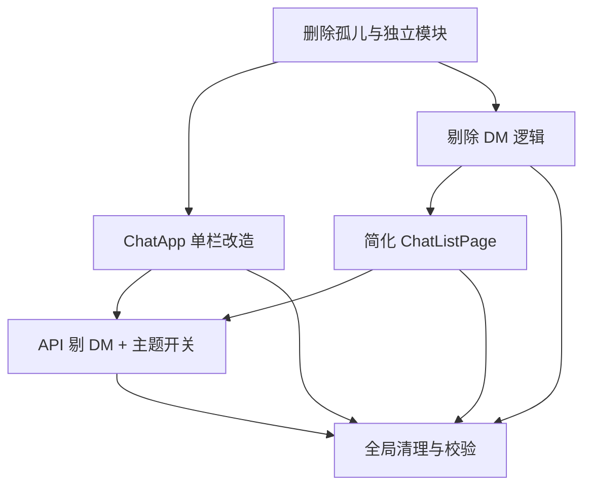

# 还原为「多房间群聊」应用 — 架构设计与任务分解

> 作者：高见远（架构师）
> 范围：删除微信式 4-Tab / 联系人 / 发现 / 我 / 加好友 / 单聊(DM) 全部逻辑，保留多房间群聊核心，移动端单栏（房间列表 ⇄ 会话视图）。
> 注意：本文档只做设计与任务分解，不含实现代码。

---

## 1. 保留 / 删除清单（逐文件 KEEP / DELETE / SIMPLIFY）

### 1.1 DELETE（整文件删除）

| 文件 | 理由 |
|------|------|
| `src/components/chat/BottomTabBar.tsx` | 4-Tab 底部导航，整体删除 |
| `src/components/chat/ContactsPage.tsx` | 联系人/好友页，删除 |
| `src/components/chat/DiscoverPage.tsx` | 发现页，删除（全局搜索入口需平移到 ChatListPage） |
| `src/components/chat/MePage.tsx` | 我页，删除（唯一手动主题开关随之迁移，见 §4） |
| `src/components/chat/AddFriendModal.tsx` | 加好友弹窗，含 `onStartDM` 单聊入口，删除 |
| `src/components/chat/SwipeableItem.tsx` | 滑动手势组件，孤儿文件（全仓无引用），删除 |
| `src/hooks/useChatSettings.ts` | 孤儿文件（全仓无 import），其 `loadDeletedMessages`/`addDeletedMessage` 亦无引用，删除 |
| `src/hooks/useDM.ts` | 单聊(DM) hook，删除 |
| `src/app/api/dm-list/route.ts` | DM 列表接口，删除 |
| `src/app/api/users/route.ts` | 仅被 `AddFriendModal` 使用，删 Modal 后变孤儿，删除 |
| `src/__tests__/dm.test.ts` | DM 单测，删除 |

### 1.2 SIMPLIFY（保留文件，剔除 DM / 无关分支）

| 文件 | 改动要点 |
|------|----------|
| `src/components/chat/ChatApp.tsx` | 改造为单栏 list↔chat；删除 BottomTabBar/Contacts/Discover/Me/AddFriend 的 import 与渲染、`activeTab`/`showAddFriend` 状态、`handleTabChange`/`handleStartDM`、`useChat` 解构中的 `dmRooms`/`startDM`、`unreadTotal`/`mentionTotal`；保留 `viewingChat` 与全局搜索 `SearchModal`。 |
| `src/components/chat/ChatListPage.tsx` | 简化为纯群聊房间列表：删除 `dmRooms`/`onAddFriend` 属性、DM 分区与单聊项渲染、菜单中"添加朋友"；保留"发起群聊"；空状态文案改为群聊向；**新增 `onOpenGlobalSearch` 属性**（承接原发现页的全局搜索入口）。 |
| `src/hooks/useChat.ts` | 剔除 DM：删 `useDM`/`getDMOtherUser` 导入、`dmRooms/loadDMs/startDM`、`unread` 计算中的 DM 循环、`currentRoomName` 的 `getDMOtherUser` 分支、return 中的 `dmRooms`/`startDM`；`onRoomUpdated`/`onMessageSent` 回调中的 `loadDMs()` 调用。 |
| `src/types/index.ts` | 删除 `DMRoom` 接口与 `RoomType` 类型；`Room.type` 字段一并移除（彻底剔除 DM 痕迹）。 |
| `src/config/index.ts` | 删除 `API_CONFIG.DM_LIST_ENDPOINT` 与 `DM_CONFIG`。 |
| `src/app/api/rooms/route.ts` | GET 移除 `typeFilter` 分支；POST 删除整段 `if (roomType === 'dm')` DM 创建逻辑及 `type`/`participants`/`customId` 解构；保留 public 创建、PUT、DELETE。 |
| `src/app/api/messages/route.ts` | 删除全局搜索中 `query.neq('rooms.type', 'dm')`（建议删除以彻底剔除）；GET/POST 的 roomId 校验正则去掉 `:`（原为允许 `dm:` 风格 ID）。 |
| `src/app/api/upload-media/route.ts` | 删除"Allow DM room IDs"注释与 roomId 校验正则中的 `:`。 |

### 1.3 KEEP（不动功能，仅必要引用清理/最小改动）

- 入口链：`src/app/page.tsx` → `src/app/ChatClient.tsx` → `src/components/PasswordGate.tsx` → `ChatApp`
- 群聊核心：`ChatHeader`（补主题开关）、`ChatListPage`（简化）、`MessageList`、`MessageItem`、`MessageInput`、`EmojiPicker`、`ReactionsBar`、`PinnedMessageCard`、`DateSeparator`、`MentionSuggestions`、`SearchModal`、`message-types/*`
- Hooks：`useMessages`/`useMessageLoader`/`useMessageRealtime`/`useMessageActions`/`useFileUpload`/`usePresence`/`useDraft`/`useGlobalSearch`/`useTypingIndicator`
- `lib/*`、`utils/*`、其余 API routes、`globals.css`、`layout.tsx`
- **注意**：任务说明将 `ForwardDialog` 列为保留模块，但**当前代码库不存在该文件，且全仓无任何"转发"功能实现**（见 §7 待明确事项 1）。

---

## 2. ChatApp 改造方案（单栏 list↔chat）

### 2.1 关键状态

```ts
// 仅保留一个视图开关；删除 activeTab / showAddFriend
const [viewingChat, setViewingChat] = useState(false);

// useChat 解构：移除 dmRooms / startDM
const { user, setUser, showNicknameInput, message, setMessage, messages,
        roomId, rooms, uploading, uploadingMessages, loadingMore, hasMore, isLoading,
        typingUsers, onlineUsers, recentUsers, quotedMessage, setQuotedMessage,
        handleSetNickname, handleEditNickname, handleMessageChange, handleSendText,
        handleFileChange, handleVoiceUpload, loadMoreHistory, retryMessage,
        handleWithdraw, handleEditMessage, searchQuery, setSearchQuery, isSearching,
        searchMatches, currentMatchIndex, isSearchLoading, toggleSearch, goToNextMatch,
        goToPrevMatch, switchRoom, createRoom, unreadRoomIds, draftSaved,
        mentionedRoomIds, isGlobalSearchOpen, globalSearchKeyword, setGlobalSearchKeyword,
        globalSearchFilters, updateGlobalSearchFilter, clearGlobalSearchFilters,
        globalSearchResults, isGlobalSearchLoading, openGlobalSearch, closeGlobalSearch,
        handleGlobalSearchResultClick, currentRoomName, highlightMessageId } = useChat();
```

### 2.2 处理与渲染结构（伪代码）

```tsx
if (showNicknameInput) return <NicknameOnboarding />;   // 昵称引导页，原样保留

return (
  <div className="fixed inset-0 bg-background flex items-stretch justify-center">
    <div className="flex flex-col h-full w-full max-w-2xl bg-card overflow-hidden relative"
         onDragEnter={viewingChat ? handleDragEnter : undefined}
         onDragLeave={viewingChat ? handleDragLeave : undefined}
         onDragOver={viewingChat ? handleDragOver : undefined}
         onDrop={viewingChat ? handleDrop : undefined}>

      {viewingChat ? (
        // —— 会话视图（无 tab）——
        <>
          <ChatHeader roomName={currentRoomName} onlineUsers={onlineUsers}
                      onBack={handleBackToList} onToggleSearch={toggleSearch} />
          {isSearching && <RoomLocalSearchBar ... />}
          <MessageList messages={messages} user={user} typingUsers={otherTypingUsers}
                       uploadingMessages={uploadingMessages} loadingMore={loadingMore}
                       isLoading={isLoading} hasMore={hasMore} onLoadMore={loadMoreHistory}
                       onWithdraw={handleWithdraw} onRetry={retryMessage}
                       onQuote={(msg) => setQuotedMessage(msg)} onEdit={handleEditMessage}
                       searchHighlightId={...} searchQuery={isSearching ? searchQuery : ''} />
          {quotedMessage && <QuotePreview ... />}
          <MessageInput message={message} uploading={uploading} onlineUsers={mergedOnlineUsers}
                        onMessageChange={handleMessageChange} onKeyDown={...} onFileChange={handleFileChange}
                        onVoiceRecord={handleVoiceUpload} onSend={handleSendText}
                        onPaste={handlePaste} draftSaved={draftSaved} />
          {isDragging && <DragOverlay />}
        </>
      ) : (
        // —— 房间列表视图（原 ChatListPage，去掉 DM/好友）——
        <ChatListPage
          rooms={rooms}
          currentRoomId={roomId}
          unreadRoomIds={unreadRoomIds}
          mentionedRoomIds={mentionedRoomIds}
          currentUser={user}
          onSelectRoom={handleSelectRoom}
          onCreateRoom={createRoom}
          onOpenGlobalSearch={openGlobalSearch}   // 新增：全局搜索入口（原发现页）
        />
      )}

      {/* 全局搜索浮层，保留 */}
      <SearchModal isOpen={isGlobalSearchOpen} keyword={globalSearchKeyword}
                   ... onClose={closeGlobalSearch}
                   onResultClick={(r) => { handleGlobalSearchResultClick(r); setViewingChat(true); }} />
    </div>
  </div>
);

// 处理器（保留/精简）
const handleSelectRoom = (newRoomId) => { if (newRoomId !== roomId) switchRoom(newRoomId); setViewingChat(true); };
const handleBackToList  = () => setViewingChat(false);
// 删除 handleTabChange / handleStartDM
```

### 2.3 视图切换流程（Mermaid）



---

## 3. DM 剔除清单（精确到符号）

### `src/hooks/useChat.ts`
- L8 整行删除：`import { useDM, getDMOtherUser } from './useDM';`
- L42–64 `useMessages(...)` 回调内：`onRoomUpdated` / `onMessageSent` 中的 `loadDMs();` 调用删除（保留 `fetchRooms();`）
- L246–249 整块删除：
  ```ts
  const { dmRooms, loadDMs, startDM } = useDM({ currentUser: user, onSwitchRoom: switchRoom });
  ```
- L444–451 `unreadRoomIds` memo 内 `for (const dm of dmRooms) { ... }` 整段删除
- L453 依赖数组 `}, [rooms, dmRooms, roomId]);` → `}, [rooms, roomId]);`
- L470–475 `currentRoomName` memo：删除 `getDMOtherUser` 分支，改为：
  ```ts
  const currentRoomName = useMemo(() => rooms.find((r) => r.id === roomId)?.name || '', [rooms, roomId]);
  ```
- L520–521 return 对象内删除 `dmRooms,` 与 `startDM,`

### `src/types/index.ts`
- L4 `// ============ REQ-008: 房间类型 ============` 删除
- L6 `export type RoomType = 'public' | 'dm';` 删除
- L18 `type?: RoomType;` 删除（Room 接口内）
- L22–26 `export interface DMRoom extends Room { type: 'dm'; participants: string[]; otherUser: string; }` 删除

### `src/config/index.ts`
- L87–88 删除：`// REQ-008: DM 列表` 与 `DM_LIST_ENDPOINT: '/api/dm-list',`
- L98–102 删除：`// ============ REQ-008: DM 配置 ============` 与 `export const DM_CONFIG = { ID_PREFIX: 'dm:', };`

### `src/components/chat/ChatListPage.tsx`
- L5 import 改为 `import { Room } from '@/types';`（移除 `DMRoom`）
- L10 删除 `dmRooms: DMRoom[];`、L17 删除 `onAddFriend: () => void;`
- L54、L61 解构删除 `dmRooms`、`onAddFriend`
- L100–103 `publicRooms` 简化：`const publicRooms = rooms;`（原按 `r.type` 过滤，type 字段已删）
- L106–117 `draftMap` memo：删除遍历 `dmRooms` 部分（仅遍历 `rooms`）
- L120 `renderRoomItem = (room: Room | DMRoom, isDM = false)` → `(room: Room)`，删除 `isDM`/`otherUser`/`bgColor`(仅 DM 用) 相关分支；`displayName` 直接取 `room.name`
- L204 `hasAnyRooms` 改为 `rooms.length > 0`
- L277–296 删除 DM 分区（`dmRooms.length > 0` 块）与"私聊/群聊"分段标题
- L228 菜单中"添加朋友"按钮删除，保留"发起群聊"
- 新增 props：`onOpenGlobalSearch: () => void;`（头部搜索按钮调用）
- 空状态文案改为群聊向（如"还没有群聊，点击右上角发起群聊"）

### `src/app/api/rooms/route.ts`
- GET L16 `const typeFilter = searchParams.get('type');` 删除
- GET L27–32 `if (typeFilter) {...} else { roomQuery = roomQuery.neq('type', 'dm'); }` → 直接保留 `roomQuery = roomQuery.neq('type', 'dm');`（无害 guard，隐藏历史 dm 行）
- POST L88 解构改为 `const { name, created_by } = body;`
- POST L90 `const roomType = type || 'public';` 删除
- POST L92–130 整段 `if (roomType === 'dm') { ... return ... }` 删除
- 保留 L132 起 public 创建、PUT、DELETE

### `src/app/api/messages/route.ts`
- GET L71 `query = query.neq('rooms.type', 'dm');` 删除（彻底剔除；保留亦无害）
- GET L131 roomId 正则 `^[a-zA-Z0-9\u4e00-\u9fff_:-]+$` → 去掉 `:` → `^[a-zA-Z0-9\u4e00-\u9fff_-]+$`
- POST L224 同正则去掉 `:`

### `src/app/api/upload-media/route.ts`
- L45 注释"Allow DM room IDs (contain colons)"删除
- L46 正则 `^[a-zA-Z0-9\u4e00-\u9fff_:-]+$` → 去掉 `:`

---

## 4. 主题切换落点

### 4.1 核实结论
**ChatHeader 当前没有主题开关。** 其 props 仅 `roomName / onlineUsers / onBack / onToggleSearch`，内部只有"返回"与"搜索"两个按钮（见 `ChatHeader.tsx` L14–55）。唯一的手动主题开关原本在 `MePage.tsx`（L34 `useTheme()`、L106 `setTheme(...)`）。删除 MePage 后该入口会丢失。

### 4.2 最小恢复方案（复用 next-themes）
`next-themes` 已在 `layout.tsx` 通过 `ThemeProvider attribute="class"` 启用，`CodeBlock.tsx` 已在用 `useTheme()`，基础设施完备。

- **ChatHeader**：引入 `useTheme()`，在右侧 `min-w-[50px] justify-end` 区块、`Search` 按钮旁新增主题切换按钮（Sun/Moon 图标）。`onClick` 调 `setTheme(theme === 'dark' ? 'light' : 'dark')`。
- **ChatListPage**：列表视图无 ChatHeader，为保持主题始终可达，在其头部右侧空槽（原 `<div className="min-w-[60px]" />`）同样放置切换按钮。
- **建议抽一个极小组件** `src/components/chat/ThemeToggle.tsx`（约 20 行），两处复用，避免重复与保证设计系统一致。

### 4.3 设计系统合规（关键）
切换按钮**严禁**出现 MePage 旧实现的硬编码色（`bg-gray-300 dark:bg-gray-600`、`bg-green-500`、`text-green-600`、`amber-50 dark:bg-amber-900/20`、`amber-600` 等）。统一用语义令牌，例如：
- 容器：`className="w-9 h-9 rounded-lg flex items-center justify-center text-muted-foreground hover:bg-muted transition-colors"`
- 图标：`text-primary` / `text-foreground`
- 开关轨道可用 `bg-primary` / `bg-muted` + `bg-card` 圆点，不使用 green/gray 字面量。

---

## 5. 有序任务列表（按实现依赖排列）

> 每个任务标注文件与动作；工程师按 T01→T06 顺序执行，T05/T06 可在 T02–T04 之后并行收尾。

- **T01 删除孤儿与独立模块**
  - 文件：`BottomTabBar.tsx`、`ContactsPage.tsx`、`DiscoverPage.tsx`、`MePage.tsx`、`AddFriendModal.tsx`、`SwipeableItem.tsx`、`useChatSettings.ts`、`useDM.ts`、`api/dm-list/route.ts`、`api/users/route.ts`、`__tests__/dm.test.ts`
  - 动作：整文件删除（含相关 import 在 T02 一并清理）

- **T02 ChatApp 改造为单栏 list↔chat**
  - 文件：`ChatApp.tsx`
  - 动作：删除 BottomTabBar/Contacts/Discover/Me/AddFriend 的 import 与渲染、`activeTab`/`showAddFriend` 状态、`handleTabChange`/`handleStartDM`、`useChat` 解构中的 `dmRooms`/`startDM`、`unreadTotal`/`mentionTotal`；按 §2 调整渲染结构，保留 `viewingChat` + `SearchModal`；全局搜索入口暂挂起（待 T04 接回 `onOpenGlobalSearch`）

- **T03 剔除 DM 逻辑**
  - 文件：`useChat.ts`、`types/index.ts`、`config/index.ts`
  - 动作：按 §3 精确删除符号（useDM 导入、dmRooms/loadDMs/startDM、unread DM 循环、currentRoomName getDMOtherUser 分支、return 中两字段；`DMRoom`/`RoomType`/`Room.type`；`DM_LIST_ENDPOINT`/`DM_CONFIG`）

- **T04 简化 ChatListPage**
  - 文件：`ChatListPage.tsx`
  - 动作：按 §3 简化为纯群聊列表；删除 DM 分区/单聊项/菜单"添加朋友"；`publicRooms` 改 `rooms`；新增 `onOpenGlobalSearch` 属性并在头部加搜索入口；空状态文案改为群聊向；与 T02 对齐 props

- **T05 API 路由剔除 DM 分支 + 主题开关落点**
  - 文件：`api/rooms/route.ts`、`api/messages/route.ts`、`api/upload-media/route.ts`、`ChatHeader.tsx`、`ChatListPage.tsx`、`ThemeToggle.tsx`（新建）
  - 动作：按 §3 清理 rooms/messages/upload-media 的 DM 分支与正则 `:`；新增 `ThemeToggle` 并在 ChatHeader 与 ChatListPage 接入 `useTheme` 切换（语义令牌，见 §4.3）

- **T06 全局引用清理与校验**
  - 文件：全仓（重点 `ChatApp.tsx`、各受改文件）、`layout.tsx`
  - 动作：删除残留未使用 import（见 §6 清单）；`layout.tsx` 的 `<meta name="theme-color" content="#2563eb">` 硬编码蓝改为暖系主色 `#B8573D`（待确认，见 §7.5）；运行 `tsc --noEmit` / `next lint` / `vitest run` 确认无破损；与团队确认 ForwardDialog 缺失（§7.1）

### 5.1 任务依赖图（Mermaid）



---

## 6. 共享知识 / 约定（跨文件一致性）

- **导入规范**：统一用 `@/` 别名（见 `tsconfig.json` paths），禁止 `../../../` 相对路径。
- **语义令牌（硬性）**：界面颜色只用 `bg-background / bg-card / bg-primary / bg-muted / bg-accent / bg-destructive / border-border / text-foreground / text-muted-foreground / text-primary / text-destructive / ring-primary` 等。禁止 `blue/gray/white/green/amber` 等硬编码色（MePage 旧实现已随删除；新建 ThemeToggle 必须合规）。
- **业务生成色豁免**：`stringToColor()` 调色板（头像背景）属运行时生成色，不在禁令范围，保留。
- **删除后潜在未使用 import 清单（T06 清理）**：
  - `ChatApp.tsx`：`TabKey`、`BottomTabBar`、`AddFriendModal`、`ContactsPage`、`DiscoverPage`、`MePage` 整段；`useChat` 解构的 `dmRooms`/`startDM`；`ArrowRight` 保留（昵称页用），其余 `Upload/Search/ChevronUp/ChevronDown/X` 仍用。
  - `useChat.ts`：`useDM`、`getDMOtherUser`。
  - `types/index.ts`：`DMRoom`、`RoomType`。
  - `config/index.ts`：`DM_CONFIG`、`DM_LIST_ENDPOINT`。
  - `ChatListPage.tsx`：`DMRoom`、`onAddFriend`、`dmRooms`、`isDM` 形参、`UserPlus` 图标（若菜单不再需要）。
- **全局搜索**：`useGlobalSearch` + `SearchModal` 已存在，仅入口从 DiscoverPage 平移到 ChatListPage（新增 `onOpenGlobalSearch`）。
- **next-themes**：`layout.tsx` 已 Provider（`attribute="class"`），`setTheme('dark'|'light')` 即可；`CodeBlock` 已示范用法。
- **Room 类型变更**：剔除 `type` 字段后，`rooms/route.ts` 仍返回 `type` 列但前端忽略即可；`ChatListPage.publicRooms` 直接等于 `rooms`。
- **转发功能**：当前无 `ForwardDialog`/转发实现（见 §7.1），勿在改造中误引用。

---

## 7. 待明确事项（请主理人/用户确认）

1. **ForwardDialog 缺失**：任务说明将 `ForwardDialog`（转发到其他群聊房间）列为保留模块，但**当前代码库无此文件，且全仓无任何"转发"功能实现**。请确认：本次还原是否需要**新建** ForwardDialog？还是保持现状（不引入转发）？
2. **历史 DM 数据**：删除 DM 逻辑后，DB 中可能残留 `type='dm'` 的 rooms 行。建议前端用 `rooms/route.ts` 的 `neq('type','dm')` 隐藏即可，是否还需要清理/迁移数据？
3. **`Room.type` 字段范围**：建议前端类型删除 `type`；`rooms/route.ts` POST 仍写入 `'public'`、GET 仍返回 `type`。是否要同步删除 DB 列/接口字段？建议接口保留、前端忽略（最小改动）。
4. **全局搜索是否保留**：假设保留（核心"搜索"功能），入口平移到 ChatListPage。若也要删，请确认。
5. **theme-color meta**：`layout.tsx` `<meta name="theme-color" content="#2563eb">` 是硬编码蓝色，是否符合"暖系档案风"？建议改为 `#B8573D`。
6. **useChatSettings 的未接线功能**：`loadDeletedMessages`/`addDeletedMessage`（"仅对自己隐藏已删除消息"）当前全仓无引用，按孤儿一并删除，是否确认无影响？
7. **主题切换覆盖视图**：除 ChatHeader 外，是否也需在 ChatListPage（房间列表视图）提供主题入口？建议两处都加（已纳入 T05）。
